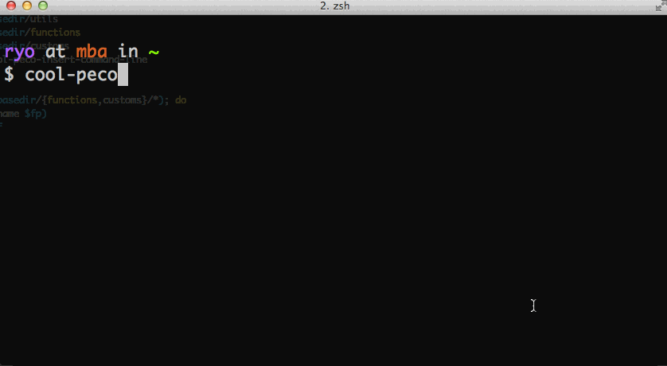

# cool peco

[peco](https://github.com/peco/peco) utils.

## Functions

- cool-peco-filename-search
- cool-peco-ghq
- cool-peco-git-checkout
- cool-peco-git-log
- cool-peco-history
- cool-peco-ps
- cool-peco-ssh
- cool-peco-tmux-session
- cool-peco-aws-ec2-instances



## Install

```
CPDIR=~/
cd $CPDIR
git clone https://github.com/ryoppy/cool-peco.git
cd cool-peco
sh ./install.sh
```

and re-login.

## Usage

```
$ cool-peco-<TAB>
```

## Alias

keybind or alias

add ~/.zshrc

```
bindkey '^r' cool-peco-history # ctrl+r
```

or

```
alias hist=cool-peco-history
```

## Setting examples

add ~/.zshrc

```
bindkey '^r' cool-peco-history # ctrl+r
bindkey '^h' cool-peco-ssh
bindkey '^p' cool-peco-ps

alias ff=cool-peco-filename-search
alias gbb=cool-peco-git-checkout
alias gll=cool-peco-git-log
alias ta=cool-peco-tmux-session
alias cg=cool-peco-ghq
```


## Add custom functions

If you wanna add new function, just add to `./customs` directory.

```
$ cp ./customs/cool-peco-custom-example ./customs/cool-peco-custom-new
```

and re-login.

```
$ cool-peco-custom-new
```

use alias?

```
bindkey '^e' cool-peco-custom-new # ctrl+e
# or
alias cn=cool-peco-custom-new
```

`./customs/*` is contains `.gitignore`.

## Why "cool" peco

"cool poco" is japanese comedian. ヾ(⌒(ﾉ'ω')ﾉ


